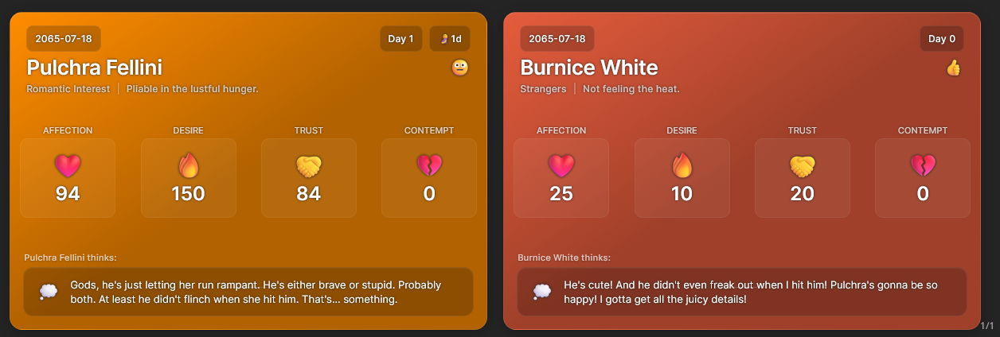
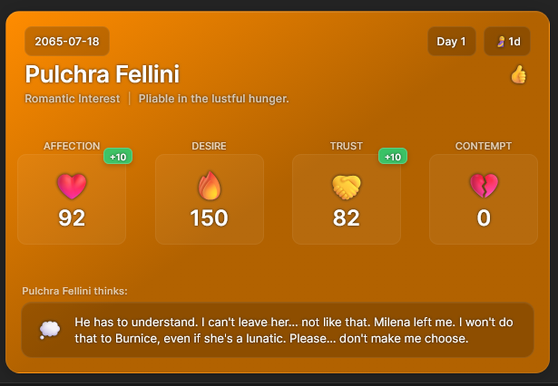
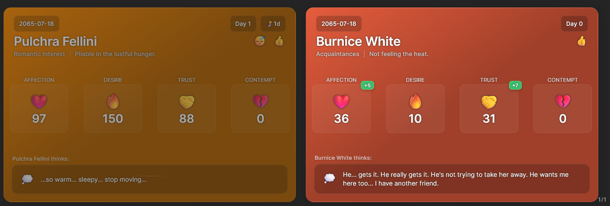

# Silly Sim Tracker

A powerful SillyTavern extension that dynamically renders visually appealing tracker cards based on JSON data embedded in character messages. Perfect for dating sims, RPGs, or any scenario where you need to track character stats, relationships, and story progression.



## Installation

1. **Copy the Extension Link**
   - Copy the repo URL (`https://github.com/prolix-oc/SillyTavern-SimTracker`) and keep it in your clipboard

2. **Install in SillyTavern**
   - Open the extensions menu (3 stacked cubes)
   - Click on "Install Extension"
   - Paste URL into repo URL field. OPTIONALLY: select a branch or version of the extension
   - Choose install scope (either for you or globally)

3. **Verify Installation**
   - The extension should now appear in your SillyTavern settings
   - You can access the configuration panel through the Extensions drawer

## Features

### Core Functionality
- **Dynamic Tracker Cards**: Automatically generates beautiful, responsive tracker cards from JSON data in character messages
- **Flexible Data Structure**: Supports both simple and complex data formats with automatic migration tools
- **Real-time Rendering**: Cards update instantly as new messages are received
- **Multi-Character Support**: Display stats for multiple characters in a single message

### Customization Options
- **Customizable Templates**: Choose from built-in templates or create your own custom HTML templates
- **Flexible Styling**: Adjust colors, layouts, and visual elements to match your preferences
- **Configurable Code Blocks**: Set your own identifier for sim data blocks (default: "sim")
- **Thought Bubble Display**: Toggle visibility of character internal thoughts
- **Card Color Customization**: Set default background colors with automatic dark variants

### Advanced Features
- **JSON Format Migration**: Convert legacy data formats to the improved structure with one click
- **Slash Command Support**: Use `/sst-convert` to migrate all data in the current chat
- **Macro Integration**: Includes `{{sim_tracker}}` and `{{last_sim_stats}}` macros for prompt engineering
- **Data Hiding**: Option to hide raw JSON code blocks while keeping the visual cards
- **Custom Fields Definition**: Define your own data fields for use in templates and prompts

### Template System
- **Handlebars.js Templates**: Powerful templating engine for creating rich, dynamic cards
- **Built-in Helpers**: Custom helpers like `eq` and `gt` for conditional logic in templates
- **Responsive Design**: Cards automatically adapt to mobile and desktop layouts
- **Visual Indicators**: Color-coded change indicators for stat modifications
- **Status Icons**: Automatic emoji-based status indicators for health, reactions, and inactivity
- **Positionable Templates**: Templates can define their display position (Above, Bottom, Left, Right, or Macro replacement)
- **Multiple Built-in Templates**: Choose from different designs including a sleek sidebar template

### Data Structure
Supports both legacy and modern JSON formats:

**Legacy Format**:
```json
{
  "current_date": "2025-08-10",
  "current_time": "14:30",
  "Alice": {
    "ap": 75,
    "dp": 60,
    "tp": 80,
    "cp": 20
  }
}
```

**Modern Format** (recommended):
```json
{
  "worldData": {
    "current_date": "2025-08-10",
    "current_time": "14:30"
  },
  "characters": [
    {
      "name": "Alice",
      "ap": 75,
      "dp": 60,
      "tp": 80,
      "cp": 20
    }
  ]
}
```

## Usage Examples

### Single Character Card


### Multi-Character Cards


### Inactive Character Display


## Configuration

The extension offers extensive configuration options through the SillyTavern settings panel:

1. **Enable/Disable**: Master switch to turn the extension on or off
2. **Code Block Identifier**: Customize the keyword used to identify sim data blocks
3. **Default Card Color**: Set the background color for cards
4. **Thought Bubble Visibility**: Toggle display of character thoughts
5. **Template Selection**: Choose from built-in templates or load custom ones
6. **Template Position**: Choose where cards should be displayed (can be overridden by templates)
7. **Custom Fields**: Define your own data fields for tracking
8. **Data Hiding**: Hide raw JSON code blocks from chat display
9. **System Prompt**: Customize the base prompt for sim tracking

## Template Positioning

Templates can define their preferred position using HTML comments. The positioning options are:

- **ABOVE**: Display the tracker above the message content (inside the message block)
- **BOTTOM**: Display the tracker below the message content (default)
- **LEFT**: Display the tracker in a fixed sidebar on the left side of the screen
- **RIGHT**: Display the tracker in a fixed sidebar on the right side of the screen
- **MACRO**: Replace a specific macro (`{{sim_tracker_positioned}}`) in the message content

To set a position in your template, add a comment like this at the top of your template file:
```html
<!-- POSITION: LEFT -->
```

If no position is specified in the template, the extension will use the position selected in the settings panel.

### Positioning Examples

1. **ABOVE Positioning**: The tracker will appear at the top of the message block, above the reasoning details.
2. **MACRO Positioning**: The tracker will replace the `{{sim_tracker_positioned}}` macro wherever it appears in your message.

These positioning options give you fine-grained control over where your tracker cards appear in relation to your messages.

## Built-in Templates

The extension includes several built-in templates for different use cases:

1. **Default Template**: A clean, responsive design that works well in most situations
2. **Sidebar Template**: A sleek design optimized for display in sidebars with progress bars and glass-morphism effects
3. **Positionable Template**: A template that demonstrates the macro positioning feature

To use a built-in template, simply select it from the template selection dropdown in the settings panel.

## Migration Tools

To help users transition to the improved JSON format:

1. **Settings Button**: Use the "Migrate to New Format" button in the settings panel
2. **Slash Command**: Type `/sst-convert` in any chat to migrate all data in that chat
3. **Automatic Compatibility**: Both old and new formats are supported seamlessly

---
